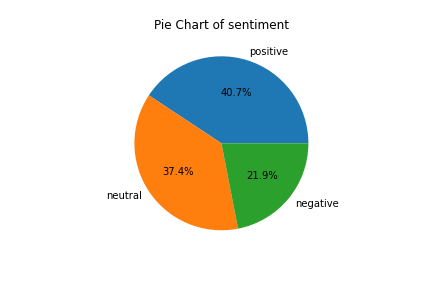

# Introduction
Recently I was watching this youtube video of PM Lee making an update on the current COVID19 situation:

[PM Lee Hsien Loong on Singapore's post-COVID-19 future, says "Do not fear" ](https://www.youtube.com/watch?v=rAhuD368Ij0) 

Looking down in the comments section got me interested in understanding how the typical (or not typical) Singaporean feel. Since I knew a fair bit about natural language processing I decided to analyse the comments of this video.
# Training methodology
As I could not find any dataset on youtube comments, I used a tweet dataset that I got from kaggle with both sentiment and emotion labels. Then I used a pretrained DistilBert model to train the data. 

# Model Output
The model outputs emotions and sentiments. 

Here are the possible emotions
* anger
* boredom
* empty
* enthusiasm
* fun
* happiness
* hate
* love
* neutral
* relief
* sadness
* surprise
* worry

Here are the possible sentiments:
* neutral
* negative
* positive

# Applying the model on a COVID19 announcement by our Prime Minister

By using a youtube comment scraper, I scraped the comments and applied the model to the comments on the video. For text that are too long, they are cut off at around ~500 words. There are about 500 comments in the end after some data cleaning.

The results are pretty good!
Here are some examples
## Examples
| Comment | Sentiment | Emotion |
| --- | --- | --- |

| LKY came out from his grave and disapproved this message. | negative | sadness |
| Thank you PM LEE, not easy for the government. Well done so far! | positive | happiness |
| thank you daddy lee | positive | love |
| Opposition & Opposition Supporter go away la.  Dont try to Divide SG United & brain  wash Singaporean to vote you for corruption.  Disgusting ! Not happy with PAP & Singapore.  Migrate to Hongkong or Taiwan protest & protest la.  Singaporean dont want Political fight.  Just want stability in the hand  of PAP.    So Regret voting for Opposition party last time | negative | hate |
| I'm always inspired and motivated by PM's speeches.  With our PM and his Cabinet leading us, I'm confident we will overcome any obstacles and come out stronger than before #SGUnited | positive | relief |
| time for the ministers to cut pay. 4G leaders make a mess, refused to apologies for their mistakes and blame us. Paid so well doing a roaring business themselves and still got face to take such high salaries. Vietnam did better than us. 0 fatalities. less than 10% got infected. We your citizens who are paying you are not dumbass. You guys better buckle up or be shipped (sheep) out | negative | sadness | 
| Thank you Singapore!  It is proud to be a Singaporean | positive | happiness |

Next I plot the data into a pie chart to see the general sentiments and emotions of the public.

It shows that Singaporeans seem to be positive but are still feeling worried.
## Download final output
You can see the final model output in <a href="out.csv" download>out.csv</a>

# Just for interest I ran it on a another video
[COVID-19: PM Lee announces 4-week extension of Singapore circuit breaker to Jun 1](https://www.youtube.com/watch?v=lhr9RsUTUE0)

## Examples

| Comment | Sentiment | Emotion |
| --- | --- | --- |

| That time is 18 days when we have the circuit breaker | neutral | worry |
| I cannot imagine the Nasty Moron in the WH speaking with so much intelligence, compassion & leadership. Majulah Singapura ! | negative | worry |
| I kind of want it to extend until september | neutral | neutral |
| Thanks God YHVH, the Almighty Creator of Heaven and Earth for Efficient and Caring Government. | positive | love |
| I want what your drinking  mr Lee | neutral | worry |
| Honestly.. 1m safe distancing is not enough. One droplets two droplets maybe it works.. but when we are talking about millions billions of droplets circulating since now there so many confirmed and undetected cases around.. can 1m safe distancing really works? I think scientists researchers really need to confirm this. A drop can fall on the ground and dries up in short distances. But when theres too much it works like tsunami. The whole world need to think about this.. this is not just short distance airborne anymore. We are talking about much more particles that combines and travel even further than just 1m. | neutral | worry |
| Dying with envy here. Your prime minister appears on TV and assures that they are above the situation and you have the resources to tackle the virus. Well, you should be grateful... Here in our country, it is what it is that you can surmise from the news. | positive | worry |
| Right on PM Lee.  Stay Safe. Want to be president of America?  Wait, you can't, because you are not America born.  Doesn't hurt in dreaming. | positive | neutral |

## Download model output 
You can see the final model output in <a href="out2.csv" download>out2.csv</a>
# And Here are the stats
## Sentiment
| sentiment | Do not fear video | Extend 4 weeks video |
| --- | --- | --- |

| positive | 40.7% | 30.4% |
| negative | 21.9% | 17.8% |
| neutral | 37.4% | 51.8% | 

## Emotion
| emotion | Do not fear video | Extend 4 weeks video |
| --- | --- | --- |

| worry | 33.2% | 32.6% |
| sadness | 8.7% | 5.8% |
| neutral | 28.9% | 37.9% |
| relief | 1.8% | 2.5% |
| hate | 1.6% | 2.5% |
| happiness | 19.0% | 13.1% |
| surprise | 0.8% | 0% |
| love | 6.1% | 5.3% |

Looks like positivity inreased in the Do Not Fear video. However emotionally but it seems people are more worried and sad and more happy at the same time while less people are neutral to what they feel. One thing to say for sure, love for PM lee has increased.

# Running the model yourself on any video
## Download the model

You can download the model here under [**output**](https://www.kaggle.com/garyongguanjie/comments-analysis/output)

## Run it on colab
No installation is required! Youtube comments scraper is included in this notebook all you need to do is to put in the video id.
Mount the trained model onto your google drive and run the notebook below.

